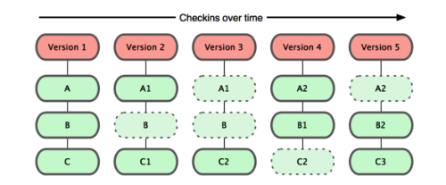
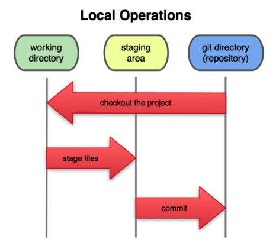

## 直接记录快照，而非差异比较

Git 并不保存这些前后变化的差异数据。实际上,Git 更像是把变化的文件作快照后,记录在一个微型的文件系统中。每次提交更新时,它会纵览一遍所有文件的指纹信息并对文件作快照,然后保存一个指向这次快照的索引。为提高性能,若文件没有变化,Git不会再次保存,而只对上次保存的快照作一链接。

## 近乎所有的操作都是本地执行

举个例子,如果要浏览项目的历史更新摘要,Git 不用跑到外面的服务器上去取数据回 来,而直接从本地数据库读取后展示给你看。所以任何时候你都可以马上翻阅,无需等待。 如果想要看当前版本的文件和一个月前的版本之间有何差异,Git 会取出一个月前的快照和当前文件作一次差异运算,而不用请求远程服务器来做这件事,或是把老版本的文件拉到本地来作比较。

## 时刻保持数据完整性

Git 使用 SHA-1 算法计算数据的校验和,通过对文件的内容或目录的结构计算出一个 SHA-1 哈希值,作为指纹字符串。该字串由 40 个十六进制字符(0-9 及 a-f)组成,看起 来就像是:

24b9da6552252987aa493b52f8696cd6d3b00373


所有保 存在 Git 数据库中的东西都是用此哈希值来作索引的,而不是靠文件名。


## 多数操作仅添加数据

commit


## 文件的三种状态


1. 已提交(committed)：Git目录中保存着的特定版本文件,就属于已提交状态;
1. 已修改(modified)：如果作了修改并已放入暂存区域,就属于已暂存状态;
1. 已暂存(staged)：如果自上次 取出后,作了修改但还没有放到暂存区域,就是已修改状态


